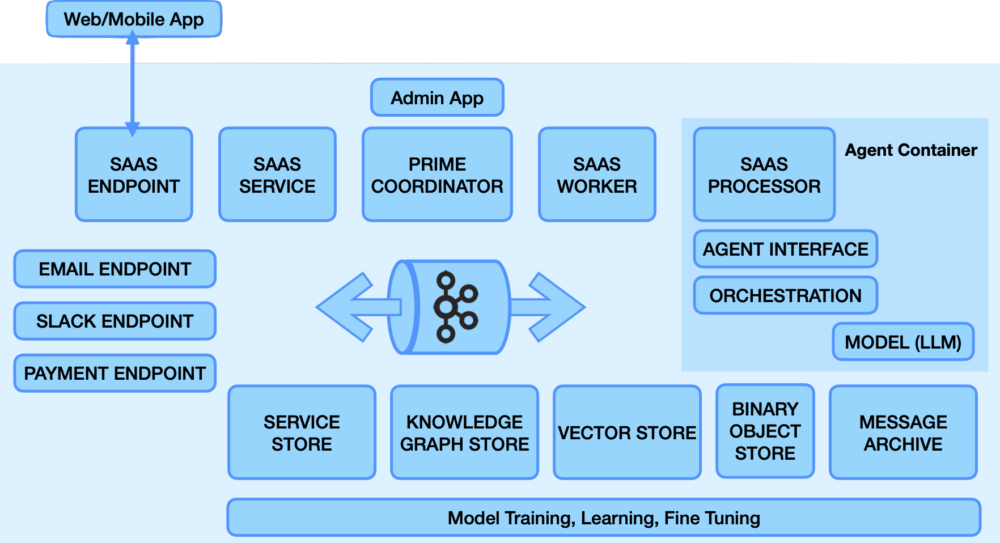

# vital-agent-ecosystem

The Vital Agent Ecosystem provides a collection of software components, knowledge models, and interfaces that together provide an A.I. Agent deployment and management platform.

Commercial support of the Vital AI Agent Ecosystem is provided by Vital AI: [https://www.vital.ai](https://www.vital.ai)

# Agent Ecosystem Architecture

The following diagram shows the A.I. Ecosystem components.

The Vital Agent Ecosystem repository provides documentation and resources for the Agent Ecosystem as a whole:

[https://github.com/vital-ai/vital-agent-ecosystem](https://github.com/vital-ai/vital-agent-ecosystem)

Documentation is managed here: [https://docs.vital.ai/agent-ecosystem](https://docs.vital.ai/agent-ecosystem).

<!--

**Here are some ideas to get you started:**

🙋‍♀️ A short introduction - what is your organization all about?
🌈 Contribution guidelines - how can the community get involved?
👩‍💻 Useful resources - where can the community find your docs? Is there anything else the community should know?
🍿 Fun facts - what does your team eat for breakfast?
🧙 Remember, you can do mighty things with the power of [Markdown](https://docs.github.com/github/writing-on-github/getting-started-with-writing-and-formatting-on-github/basic-writing-and-formatting-syntax)
-->
